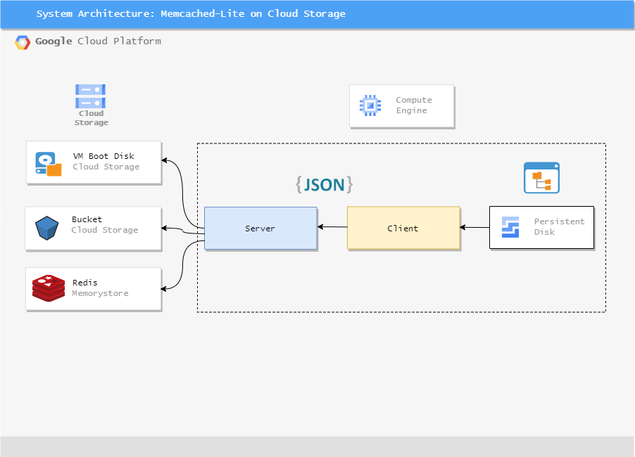

**Introduction.**  
The project deals with designing, developing, and implementing a robust Key-Value Store and deploying the same in Google Cloud Platform (GCP). A Memcached Client-Server based architecture has been chosen to start with the designing part. TCP-socket server which listens to a host and port is used to start the server and consecutively connect to the clients. Three different types of storage system (VM Boot Disk, GCS Bucket, Redis Memory Store) have been used to save the data instead of the traditional Memcached server which store the data in memory and data is wiped off once the server is either restarted or shut down. “get” and “set” instructions have been used to either get the data from the Memcached server, insert, or update a new value. Concurrent connection of multiple clients connecting to a single server and performing the instructions have been considered.

**Prerequisites.**  
•	Install Google SDK in your local machine to access Google Cloud Platform.  
•	A Google Cloud account with active credits and projects are required.  
•	Clone this Repo  
•	Create a Redis Instance on Google Cloud (Included in the VirtualMachineCreation.sh bash script)  
•	Create a Bucket and Blob in Google Cloud Storage (Not included in the Bash script since I created it manually and did not get the equivalent CLI command)  
•	Mention respective bucket and blob details in the configFile.py  

**Initial Setup and Instructions.**  
Once the Google account has been configured with active credits and project, we need to first create Virtual Machine Instances for Client and Server. We also need to create Virtual Private Cloud (VPC) network to be used by the VM and set the necessary firewall rules. The command line code to create the above are given in the Bash Script. Once the VM’s have been created, we need to setup the Git, pip to install necessary python packages. All the necessary installation packages are mentioned in “requirements.txt”. Additionally, I have also used Redis Memory Store for faster and effective get and set operations. Script to create a Redis instance has also been included in the bash script. Ensure that the bucket and blob storage are created in Google Cloud Storage.  

**Files.**  
**1.	Server Side**  
•	kvsserver.py – Contains the main server code to handle incoming client calls and process the get and set operations.  
•	configFile.py – Contains the server configurations such as IP, port, encoding format, header size, bucket name, blob name, Redis IP address, port, authentication password.  
•	generatekvsTesting.py – Generates 100 records of Keys-Values in KeyValueStore.txt for performance testing.  
•	KeyValueStore.txt – Local file to store the key-value pair.  
**2.	Client Side**  
•	kvsclient.py – Contains the main client code to send the get and set message to the server.  
•	configFile.py – Contains the client configurations such as Server IP, port, encoding format, header size, file name.  
•	generatekvsTesting.py – Generates 100 records of Keys in Keys.txt and values in values.txt for performance testing.  
•	Keys.txt – Local file to store the keys to be used for performance testing and comparison.  
•	Values.txt – Local file to store the values to be used for performance testing and comparison.  
•	Kvsmultipleclient.py – Contain code to spawn multiple clients at the same time to test concurrency.  

